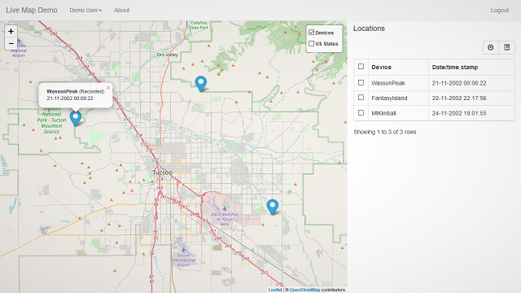

# Livemap
A simple [Node.js](https://nodejs.org) server that ingests location updates and shows markers on all attached web clients. [MQTT](http://mqtt.org) and HTTP POST (web hooks) are supported to input new locations. Originally developed to monitor devices with the Geofancy app installed (now: [Locative](https://itunes.apple.com/nl/app/locative/id725198453)). Tested on Docker and a local NodeJS setup.

Livemap has a build in web server that provides the original UI. [Livemap-UI](https://github.com/edenb/livemap-ui) is the modern SPA website based on [Vue.js](https://vuejs.org/). Functionality of both websites are identical but new features will only be available in de modern UI.

## Features
* Instant (live) marker updates using WebSockets
* Multi user with authentication
* Mobile first GUI design
* Server side storage with PostgreSQL

## Live demo
The demo contains 3 devices that play back recorded tracks.

> Username: demo
>
>Password: demodemo

### [Demo modern UI](https://livemap.vercel.app)

### [Demo original UI](https://livemap.fly.dev)

## Set up your own Livemap server
The easiest way to get started is to deploy the application on Docker. The [Docker-livemap](https://github.com/edenb/docker-livemap) project deploys livemap including Postgres and an MQTT broker. 

On a local NodeJS setup you first need to install some packages.
* Download and install the newest Node.js 22 version from [Node.js](https://nodejs.org)
* Download and install the newest [PostgreSQL 16](http://www.postgresql.org/download/)
* Copy or clone the latest Live Map from GitHub into a project directory of your choice
* In the project directory run `npm install`
* In PostgeSQL create a new database user and a database
* Add the database settings to `config/production.json`
* Start with `npm start`

## How to use
Login with username 'admin' and any password the first time. Don't forget to change the admin password right away.

## Wishlist
* Show tail of previous locations on selected marker
